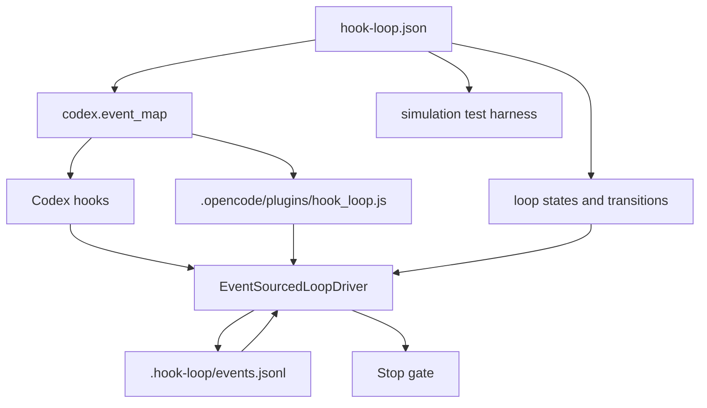

# hook-loop

`hook-loop` makes autonomous agent outer loops **explicit**: you write a state machine in JSON, and hook-loop wires it into platform hooks (Codex / opencode) so the agent is gated by the loop at every step — it cannot stop until the state machine reaches a terminal state.

## Basic Usage

### 1. Install

```bash
uv sync                          # install hook-loop into .venv
```

### 2. Choose or write a DSL

A hook-loop DSL is a JSON state machine with `loop`, `simulation`, and `codex.event_map` sections. Start from the examples in [`gallery/`](gallery/), or read [`gallery/README.md`](gallery/README.md) for the DSL writing guide and state-machine diagrams.

### 3. Validate & simulate

```bash
uv run hook-loop validate my-loop.json        # → valid: plan_execute
uv run hook-loop simulate my-loop.json         # → final_state: done
```

### 4. Use in a coding agent

#### Codex

Generate the hook scaffold (Codex `hooks.json` + embedded DSL):

```bash
uv run hook-loop codex install \
  --profile plan_execute \
  --dsl my-loop.json \
  --destination . \
  --write
```

This creates `.codex/hooks.json` and `hook-loop.json` in your project. Codex 0.142+ reads hooks from `CODEX_HOME` (default `~/.codex/`). To keep hooks project-level without touching your global config, set `CODEX_HOME` to an in-project directory:

```bash
mkdir -p .codex-home
cp .codex/hooks.json .codex-home/hooks.json
ln -sf ~/.codex/auth.json .codex-home/auth.json   # read-only ref, no credentials copied
cp ~/.codex/config.toml .codex-home/config.toml

# Absolute path to hook-loop (hook subprocess may not have .venv on PATH):
HOOK_BIN="$(pwd)/.venv/bin/hook-loop"
sed -i "s|hook-loop |$HOOK_BIN |g" .codex-home/hooks.json
```

Then run codex with that home:

```bash
CODEX_HOME=$PWD/.codex-home codex exec \
  --skip-git-repo-check \
  --dangerously-bypass-approvals-and-sandbox \
  --dangerously-bypass-hook-trust \
  -C . \
  "implement feature X and verify with pytest" \
  --json
```

Check the loop state machine trace:

```bash
cat .hook-loop/events.jsonl
```

#### opencode

Generate the opencode plugin scaffold:

```bash
uv run hook-loop opencode install \
  --profile plan_execute \
  --dsl my-loop.json \
  --destination . \
  --write
```

This creates:
- `.opencode/plugins/hook_loop.js` — a JS plugin that bridges opencode events to `hook-loop opencode-hook`
- `hook-loop.json` — your embedded DSL

opencode loads the plugin automatically. The plugin translates opencode events (`tool.execute.before` → `PreToolUse`, `tool.execute.after` → `PostToolUse`, `session.idle` → `Stop`, `message.updated` → `UserPromptSubmit`) and shells out to `hook-loop opencode-hook`.

Run an opencode agent:

```bash
opencode run "implement feature X and verify with pytest"
```

Evidence and state transitions are logged to `.hook-loop/events.jsonl`.

### How it works



Every hook call recovers the current state from the event log, checks event_map rules, applies matching transitions, and records the result. `PreToolUse` guards risky commands. Codex `Stop` blocks until a terminal state is reached; opencode `session.idle` records the same stop decision without aborting the session worker.

## Requirements

- Python 3.11+
- [uv](https://docs.astral.sh/uv/) for Python environment and dependency management

## What Is Implemented

- Schema loading and validation for loop definitions.
- Guard-aware state transitions.
- Append-only JSONL event log with session-aware recovery.
- In-process hook bus with allow/block/steer decisions.
- Machine-readable evaluator verdict parsing.
- Minimal fake-agent runtime simulation for pass, rework, stop, resume, and hook-block flows.
- `hook-loop validate` and `hook-loop simulate` CLI commands.
- Codex hook adapter driven by `codex.event_map` in the DSL.
- opencode hook adapter with scaffold generator (`hook-loop opencode install`).
- `hook-loop codex install` scaffold generation with dry-run by default.
- See `gallery/` for 8 example DSLs and verify them all with `uv run python experiments/check_gallery_behavior.py`.

## Minimal Runtime Example

```python
from hook_loop import AgentStep, FakeAgent, FakeEvaluator, JsonlEventLog
from hook_loop import LoopDefinition, LoopRuntime, RuntimeBudget, Verdict


definition = LoopDefinition.from_dict(
    {
        "id": "software_delivery",
        "initial_state": "backlog",
        "states": ["backlog", "building", "evidence_ready", "evaluating", "done", "stopped"],
        "events": ["feature_selected", "evidence_recorded", "review_requested", "evaluator_passed"],
        "transitions": [
            {"from": "backlog", "event": "feature_selected", "to": "building"},
            {"from": "building", "event": "evidence_recorded", "to": "evidence_ready"},
            {"from": "evidence_ready", "event": "review_requested", "to": "evaluating"},
            {
                "from": "evaluating",
                "event": "evaluator_passed",
                "to": "done",
                "guards": ["evidence_bound_to_criteria"],
            },
        ],
    }
)

runtime = LoopRuntime(
    definition=definition,
    store=JsonlEventLog("events.jsonl"),
    agent=FakeAgent(
        {
            "backlog": [AgentStep("feature_selected")],
            "building": [AgentStep("evidence_recorded", {"evidence_id": "e1"})],
            "evidence_ready": [AgentStep("review_requested")],
        }
    ),
    evaluator=FakeEvaluator([Verdict("PASS", "evidence checked")]),
)

assert runtime.run_until_stop(RuntimeBudget(max_turns=3)) == "done"
```

## Current Boundaries

- A Codex hook adapter and generated scaffold are included (see above), driven by
  the `codex.event_map` in `hook-loop.json`. No Claude Code or pi adapter is
  included yet.
- Hook callbacks are in-process contracts, not a security boundary.
- `FakeAgent` and `FakeEvaluator` exist to make loop semantics deterministic in
  tests; the Codex adapter uses an event-sourced driver instead, because in Codex
  the agent is Codex itself rather than a fake.
