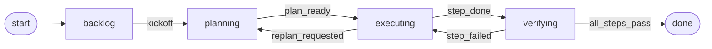
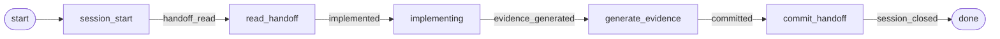
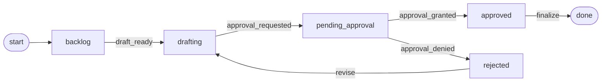
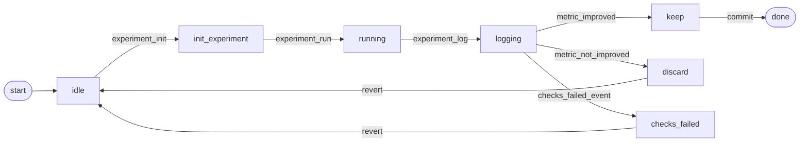
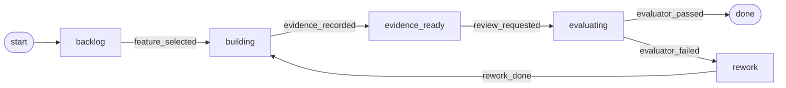
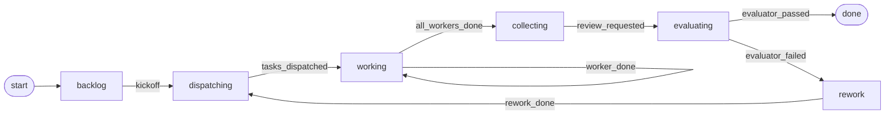
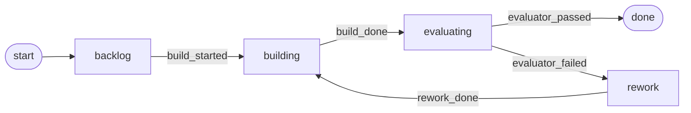
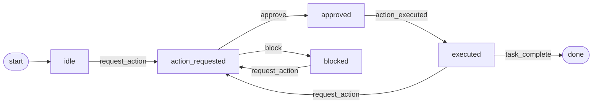

# Gallery

The gallery contains complete hook-loop DSL examples. Each file has the same shape:

```jsonc
{
  "loop": {
    "id": "plan_execute",
    "initial_state": "backlog",
    "states": ["backlog", "planning", "executing", "verifying", "done", "stopped"],
    "terminal_states": ["done", "stopped"],
    "stop_state": "stopped",
    "events": ["kickoff", "plan_ready", "step_done", "all_steps_pass"],
    "transitions": [
      {"from": "backlog", "event": "kickoff", "to": "planning"},
      {"from": "planning", "event": "plan_ready", "to": "executing"},
      {"from": "executing", "event": "step_done", "to": "verifying"},
      {"from": "verifying", "event": "all_steps_pass", "to": "done"}
    ]
  },
  "simulation": {
    "budget": {"max_turns": 8, "max_no_progress_turns": 2},
    "agent_steps": {
      "backlog": [{"event": "kickoff"}],
      "planning": [{"event": "plan_ready"}],
      "executing": [{"event": "step_done"}],
      "verifying": [{"event": "all_steps_pass"}]
    },
    "verdicts": [{"status": "PASS", "details": "all steps verified"}]
  },
  "codex": {
    "event_map": [
      {"codex_event": "SessionStart", "emit": "kickoff"},
      {"codex_event": "PostToolUse", "when": {"tool_name": "Bash", "exit_code": 0}, "emit": "step_done"}
    ]
  }
}
```

## DSL Writing Guide

| Section | What it does |
|---|---|
| `loop` | Defines the state machine: `initial_state`, allowed `states`, `terminal_states`, optional `stop_state`, known `events`, and `transitions`. |
| `simulation` | Defines deterministic fake-agent steps and verdicts so the loop can be validated without a real LLM. |
| `codex.event_map` | Maps platform hook events to loop events. opencode events are translated into Codex-style event names before matching. |

`transition` fields:

| Field | Meaning |
|---|---|
| `from` | Required source state. |
| `event` | Required loop event. |
| `to` | Required destination state. |
| `guards` | Optional list of guards that must be satisfied before the transition can apply. |

`codex.event_map` rule fields:

| Field | Meaning |
|---|---|
| `codex_event` | Hook event to match, such as `SessionStart`, `UserPromptSubmit`, `PreToolUse`, `PostToolUse`, or `Stop`. |
| `when` | Optional matcher object. All specified matchers must pass. |
| `emit` | Loop event to fire when the rule matches. |
| `record` | Optional side-effect event to append before firing `emit`. Useful for evidence. |
| `guard_satisfied` | Optional guards to mark satisfied for this emitted event. |

`when` matchers:

| Matcher | Meaning |
|---|---|
| `tool_name` | Exact tool name, for example `Bash`, `Write`, `Edit`, or `TodoWrite`. |
| `command_match` | Regex searched against the Bash command string. |
| `prompt_match` | Regex searched against prompt text. |
| `prompt_not_match` | Regex that must not match prompt text. |
| `exit_code` | Tool exit code. Integers and strings compare by string value, so `0` and `"0"` match. Missing exit codes do not match `0`. |

Validate every gallery DSL with:

```bash
uv run python experiments/check_gallery_behavior.py
```

## State Machines

### `plan_execute.json`



### `agent_handoff.json`



### `approval_gate.json`



### `autoresearch_experiment.json`



### `builder_evaluator.json`



### `multi_agent_fanout.json`



### `rework_loop.json`



### `safety_guardrail.json`


